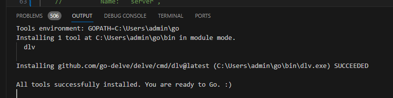

# ego
无双游戏的 go 服务器

始于2016年，一个适合入门学习的服务器代码，原团队的设计和研发文档写得很全+仔细

# 目录结构
a/ 测试目录

platform/ 主目录

# 里程碑

- (*2023/11/2)发现 debug 方法，只要安装go-dev,VsCode 直接按 DeBug Icon 会自动提示是否安装

- 建立router(路由)

基本登录等联调

业务逻辑（开房间）

- 业务逻辑（战斗）ol

# 当前启动方法（Windows)
<缺>

项目需要多个安装。。。。

# 开发过程

| 操作 | 结果
| ------------------ | ---------- |
|修改了下客户端，登录时会有这个 Warn|[RCD] Auth Step1 - Auth usrname/pwd [URL]: 192.168.0.124:8080/auth/v1/user/login?name=YXZpOTExMQ==&passwd=C4RlHXlZtMtG0jlx2oD9m-==|
|11111111111111111111| 2222 |