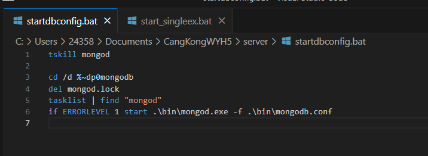

# 苍空物语服务器(lua)文档
非原golang 无双服务器，也没有源码记录，只记录一些架构和入门操作要点

# 服务器启动步骤
1. ./Mongodb/config/mongodb.conf 修改conf的 logpath 和 datapath 2个目录位置
2. ./Server/bin/script/config.lua 修改代码：服务器 ip 改为192.168.x.xx:8194; port默认为8192
3. 启动 startdbconfig.bat 和 start_singleex.bat 2个bat

# 感慨
我现在做的事情，居然和三峡大坝沿途，拯救村落文化从业者；和记录西藏美术文化的研究员差不多；居然要不断记录各种“曾经”辉煌过的各种客户端，服务器源码；好让20年后，50年后，大家知道在移动互联网诞生的头几年，百花齐放的年代，“我们”曾经也做到过世界第一，产生过无数“无与伦比”代码文化

除了这样，好像个人也没什么其他更好的办法，杯水车薪，却只能这么做了

（个人从来都不喜欢做信息归类，文档整理工作，犯困）